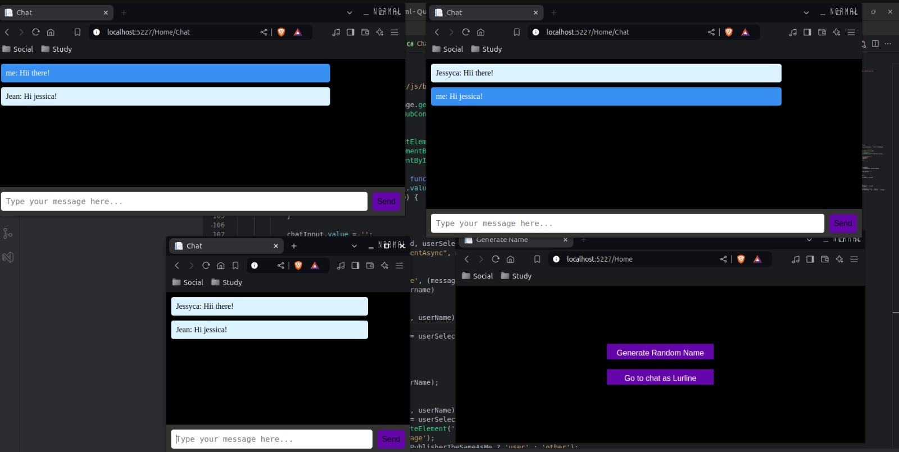

# QuickChats

# Simple Chat Application using ASP.NET Core SignalR

This is a simple chat application built with ASP.NET Core and SignalR. The app allows real-time messaging between users in a chat room format.

## Features

- Real-time messaging using SignalR.
- User-specific message display.
- Responsive layout suitable for mobile devices.
- Users can join without any login, just to request a random name to the Web Api in order to be able to join the room

## Demo

